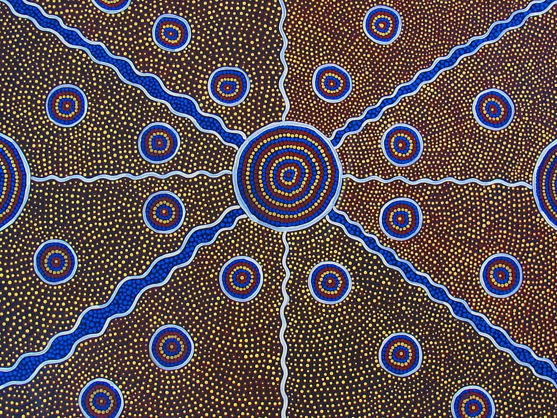
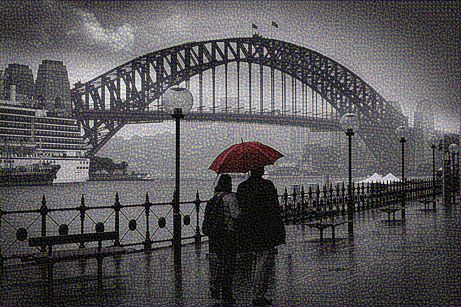

# Neural-style Transfer

This example demonstrates how to implement "Neural Style Transfer" with VGG-16 model. 

The model weights can be [downloaded here](https://drive.google.com/file/d/1gO2vzafLoM_scJIaej7F392uEvKR3pV8/view?usp=sharing)

## Content Image

## Style Image

## Output image (after 10 steps)

## Image Resources

1. [Traditional Australian aboriginal art](https://www.pxfuel.com/en/free-photo-omwvj)
2. [Sydney Harbour Bridge - Circular Quay](https://www.wallpaperflare.com/sydney-australia-circular-quay-cloudy-winter-cold-moody-wallpaper-ejzdw)

